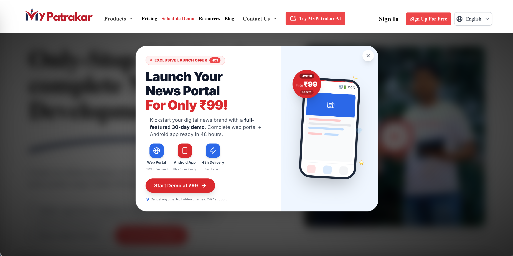
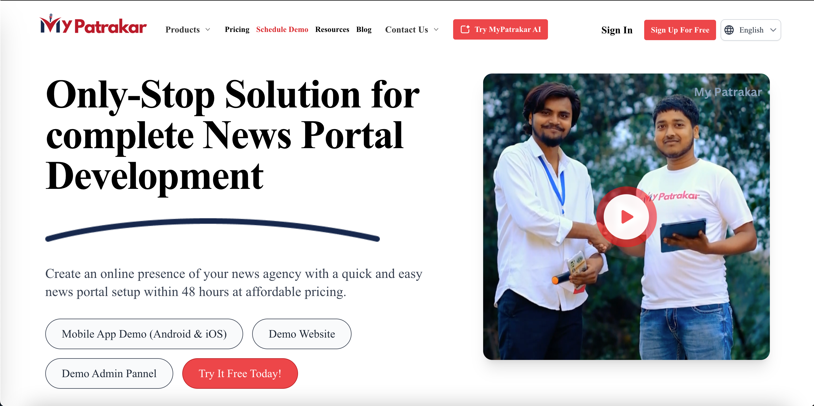
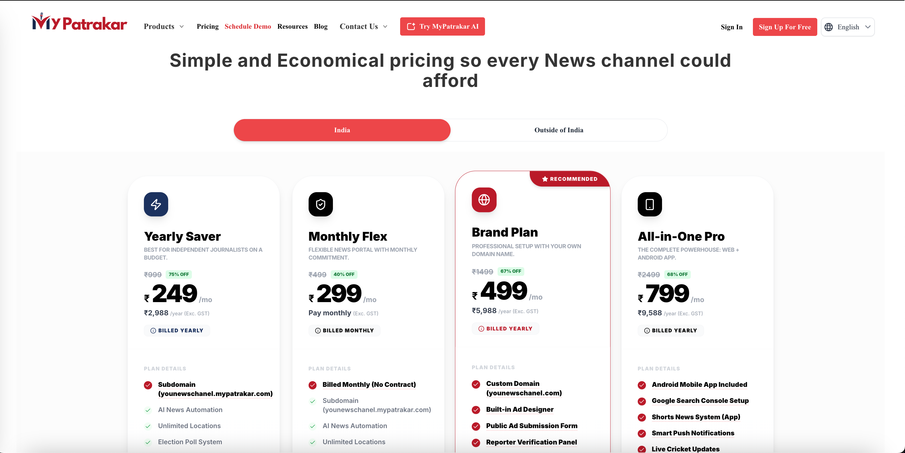
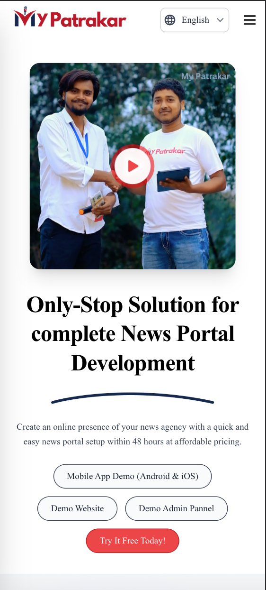
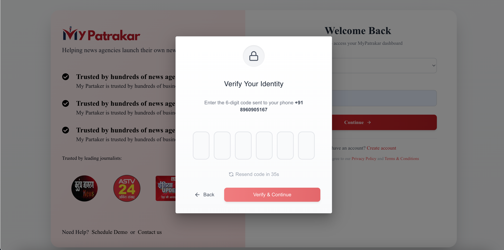
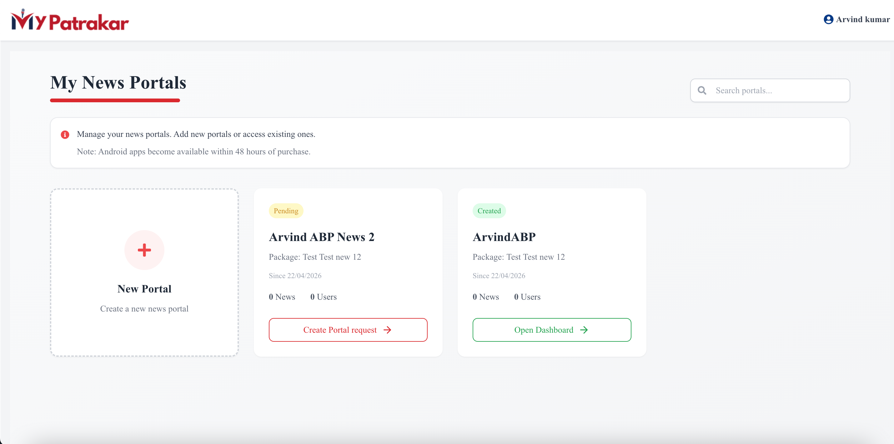
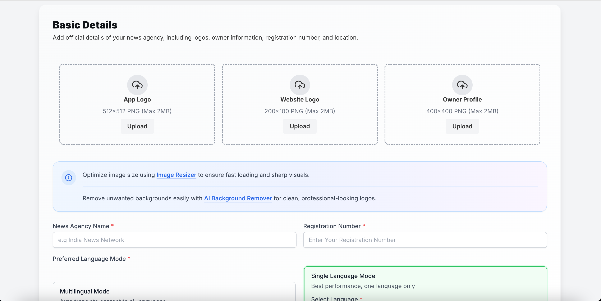
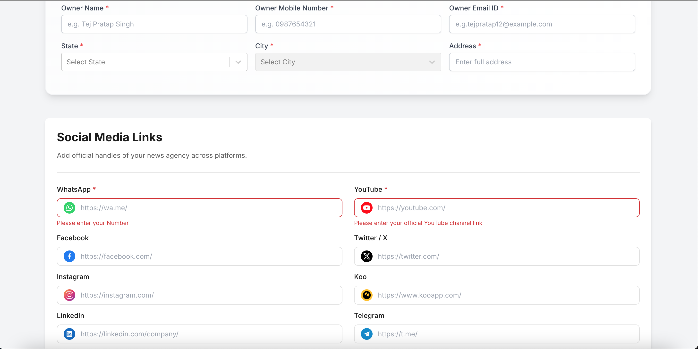
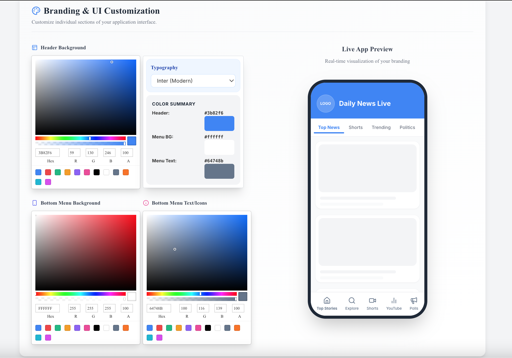
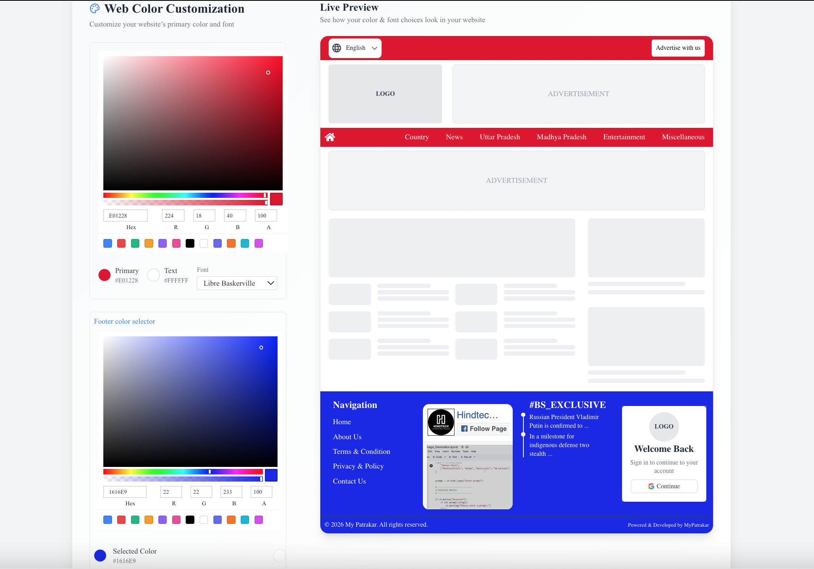

# MyPatrakar – News Portal Launch Offer

## 🚀 About The Project

**MyPatrakar** helps you launch your own digital news brand quickly and affordably.  
Get a complete **web portal + Android app** ready in just **48 hours** – starting at only ₹99 for a 30‑day demo.

### Key Features

- ✅ Full‑featured News CMS + Frontend
- ✅ Android App (Play Store ready)
- ✅ 48‑hour delivery
- ✅ 24/7 support
- ✅ No hidden charges – cancel anytime

## 💰 Exclusive Launch Offer

| Plan         | Price            | Duration |
| ------------ | ---------------- | -------- |
| Limited Demo | ~~₹499~~ **₹99** | 30 days  |

> **Limited time offer** – Launch your news brand today!

## 📸 Screenshots

### Landing Page

### Pricing Card

### Mobile Layout

### OTP Verification

### Dashboard

### Portal Request - Logo Settings

### Portal Request - Social Links

### Portal Request - App Theme

### Portal Request - Website Theme

## 🛠️ Tech Stack (Assumed)

- Frontend: ReactJs / TailwindCss / JavaScript
- Backend: PHP / Node.js (customise as per your stack)
- Database: MySQL / PostgreSQL
